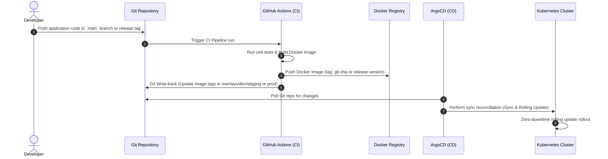

# GitOps Reference Architecture: Terraform · ArgoCD · Kustomize (Multi-Env)

This repository contains a reference architecture demonstrating best practices for managing infrastructure and application delivery using **Terraform** for cloud infrastructure provision, **Kustomize** for multi-environment template management, and **ArgoCD** for GitOps-driven deployment automation.

---

## 🗺️ 1. Architecture & GitOps Workflow

### Deployment Promotion Flow
This diagram illustrates the automated workflow when application code or tag promotion occurs:



---

## 📂 2. Repository Directory Structure

The repository is modularly structured to enforce separation of concerns:

```text
source/
├── README.md                   # Project documentation & operational runbooks
├── .github/
│   └── workflows/
│       └── ci.yaml              # CI pipeline workflow implementing Git Write-Back
├── scripts/
│   ├── demo.sh                  # 1-Click script to provision and bootstrap local demo environment
│   └── local-sealed-secret-key.yaml # Pre-generated backup private key for local Sealed Secrets decryption
├── terraform/                  # Infrastructure as Code (IaC)
│   ├── modules/                # Reusable Terraform modules
│   │   ├── k8s-cluster-eks/    # Module provisioning AWS EKS Cluster
│   │   └── k8s-cluster-kind/   # Module provisioning local Kind Kubernetes Cluster
│   └── environments/           # Self-contained environment folders
│       ├── local/              # Local env (Kind + Local backend state)
│       │   ├── main.tf, providers.tf, variables.tf, outputs.tf
│       │   └── terraform.tfvars, terraform.tfvars.example
│       ├── dev/                # Dev env (EKS + S3 remote state key 'dev')
│       │   ├── main.tf, providers.tf, variables.tf, outputs.tf
│       │   └── terraform.tfvars, terraform.tfvars.example
│       ├── staging/            # Staging env (EKS + S3 remote state key 'staging')
│       │   ├── main.tf, providers.tf, variables.tf, outputs.tf
│       │   └── terraform.tfvars, terraform.tfvars.example
│       └── prod/               # Prod env (EKS + S3 remote state key 'prod')
│           ├── main.tf, providers.tf, variables.tf, outputs.tf
│           └── terraform.tfvars, terraform.tfvars.example
├── k8s/                        # Kubernetes Declarative Configs (CD)
│   ├── base/                   # Baseline manifests shared across all environments
│   │   ├── deployment.yaml
│   │   ├── service.yaml
│   │   ├── ingress.yaml
│   │   └── kustomization.yaml
│   └── overlays/               # Environment-specific configuration patches
│       ├── local/              # Local overlay (Kind on localhost with mock credentials)
│       │   ├── kustomization.yaml, replica-patch.yaml, resource-patch.yaml
│       │   └── ingress-patch.yaml, image-patch.yaml, secret-sealed.yaml
│       ├── dev/                # Development Overlay
│       ├── staging/            # Staging Overlay
│       └── prod/               # Production Overlay
└── argocd/                     # ArgoCD Declarative Resources
    └── applicationset.yaml      # Multi-environment ApplicationSet controller
```

---

## 🛠️ 3. Implementation Details & Design Rationale

### 3.1. Infrastructure as Code (Terraform)
* **Directory-based Separation over Workspaces:**
  * **Rationale:** Terraform workspaces are prone to human errors and state cross-talk. For strict isolation between Dev, Staging, Prod, and Local (minimizing the Blast Radius), we utilize distinct per-environment directories. Each directory maintains its own provider configuration (`providers.tf`) and backend settings.
* **Backend Configurations:**
  * **Local Environment:** Configured with `backend "local"` storing state files on-disk. Integrates the `tehcnosoft/kind` provider to spin up local clusters for development and testing. Exposes local Ingress ports mapping 80/443 container ports to loopback interfaces (`127.0.0.1`).
  * **AWS EKS Environments (Dev/Staging/Prod):** Configured with `backend "s3"`. Each environment declares a static, isolated S3 object key (`k8s-cluster/<env>/terraform.tfstate`) to prevent state overwriting.
  * **DynamoDB State Locking:** S3 backend environments declare the `dynamodb_table` setting, securing lock records to prevent concurrent writes from multiple developers or CI runs.

### 3.2. Configuration Management (Kustomize)
* **Base/Overlay inheritance:** Standard templates (containers, probes, services, ingress structure) are kept in `base/`. Environment overlays override limits, replica sizes, and domain hostnames.
* **Local Mocking Strategy:** The `local` overlay swaps the core API-Gateway container image with `hashicorp/http-echo:latest`, mapping health check endpoints to port `8080` to prevent Kubernetes liveness/readiness probes from crashing on workstations.
* **Kubernetes Recommended Labels:** We leverage Kustomize's `commonLabels` at the base level to propagate standard Kubernetes metadata labels (`app.kubernetes.io/name`, `app.kubernetes.io/managed-by`) to all resources automatically.
  * **Avoiding Selector Conflict Gotcha:** To prevent locked selectors and orphaned Pods in overlays, we omit `app.kubernetes.io/instance` from base `commonLabels`. Instead, each environment overlay defines its own instance label (e.g. `api-gateway-dev`, `api-gateway-staging`, `api-gateway-prod`, `api-gateway-local`) which Kustomize merges dynamically at build time.
* **Modern Ingress Class Compliance:** In compliance with Kubernetes 1.22+, we omit the deprecated `kubernetes.io/ingress.class` annotation and explicitly leverage the `spec.ingressClassName: nginx` standard.
* **Kustomize Namespace CRD Gotcha:** 
  * **Issue:** Kustomize does not automatically rewrite target namespaces for Custom Resource Definitions (CRDs) such as Bitnami's `SealedSecret` because they are outside of the core Kubernetes API.
  * **Resolution:** We explicitly hardcode the target namespace within each overlay's `secret-sealed.yaml` metadata block and document this behavior within the manifest comments to avoid deployment drift.
* **ConfigMap Hash Suffixes:** ConfigMaps are generated using Kustomize `configMapGenerator`. Changing a configuration key changes the ConfigMap hash, prompting Kubernetes to automatically trigger a rolling update of Pods.

### 3.3. Continuous Delivery & Sync Policies (ArgoCD)
* **ApplicationSet List Generator:** Orchestrates dev, staging, prod, and local deployments in a single declarative file.
* **Resilient Sync Retry Strategies:** Both manual and automated ApplicationSet templates feature sync retries configured with exponential backoff (`duration: 5s`, `factor: 2`, `maxDuration: 3m`, `limit: 3`) to survive transient cluster network drops.
* **Sync Strategy Isolation:**
  * **local/dev/staging:** Automatic sync (`automated`), automated garbage collection (`prune`), and drift override (`selfHeal: true`).
  * **prod:** Manual synchronization to allow manual validation gates. Out-of-sync states flag visual changes in the ArgoCD UI, prompting operators to manually trigger deployment sync.

---

## ⚡ 4. Operational Runbook Q&A

### Q1: A developer manually edits a production deployment using `kubectl edit`
* **With `selfHeal: true` (e.g., Dev/Staging):** ArgoCD immediately detects the Configuration Drift, compares the cluster configuration with Git, and overwrites the manual changes within seconds, reverting the cluster state to Git's state.
* **With `selfHeal: false` (e.g., Production):** ArgoCD detects the drift and changes the application status to `OutOfSync`. However, it does not automatically overwrite the manual changes, allowing temporary hotfixes to run on the cluster until a manual "Sync" is triggered or a new Git commit is pushed.

### Q2: Correct GitOps rollbacks in Production
In GitOps, manual cluster rollback command `kubectl rollout undo` is a anti-pattern because the Git repository remains unchanged, leading to configuration drift and auto-reconciliation issues.
* **Correct Rollback Steps:**
  1. Revert the target commit on the Git repository (e.g., `git revert <bad-commit-sha>`).
  2. Open a Pull Request and merge the revert into the main/production branch.
  3. ArgoCD detects the commit change, showing `OutOfSync`.
  4. Perform manual sync trigger in ArgoCD to rollout the reverted version safely.

### Q3: Secrets management options in GitOps

| Solution | Mechanism | Pros | Cons |
| :--- | :--- | :--- | :--- |
| **Sealed Secrets** | Encrypted YAML using public key; decrypted inside cluster. | Store securely in Git, no cloud dependency, lightweight. | Coupled to cluster decryption key. Losing the cluster controller private key breaks access. |
| **External Secrets (ESO)** | Dynamically pulls secrets from Cloud Vault/KMS at runtime. | Industry-standard security, automated rotation, central secrets storage. | More complex setup, cloud provider API costs. |
| **SOPS** | Encrypted values in Git decrypted via plugins in ArgoCD. | KMS independent, decoupled from cluster. | Requires custom plugins inside the ArgoCD control plane. |

👉 **Decision for this repo:** **Sealed Secrets** is utilized to provide encryption-at-rest directly on Git without external cloud dependencies.

### Q4: Kustomize vs Helm

* **Kustomize:** Template-free configuration override via overlays and patches. Best suited for in-house applications where you own the manifests and want standard Kubernetes YAML files without complex templating overhead.
* **Helm:** Package manager that uses templates to render manifests based on variable values (`values.yaml`). Best suited for third-party off-the-shelf software (e.g., ingress-nginx, Prometheus) with complex dependency trees and heavy configuration flexibility.

---

## 🚀 5. Quick Start Guide

### 5.1. Running Local 1-Click GitOps Demo

To easily evaluate and demonstrate this repository locally, we provide a 1-click bootstrap script that sets up the entire pipeline (Kind cluster, Ingress, ArgoCD, Sealed Secrets controller, and app deployment) on localhost.

1. Clone or download this repository.
2. Run the bootstrap script:
   ```bash
   ./scripts/demo.sh
   ```
3. Once completed, query the local deployment sync status:
   ```bash
   export KUBECONFIG=./terraform/environments/local/kubeconfig.yaml
   kubectl get pods -n api-gateway-local
   ```
4. Access the active local web service:
   ```bash
   curl http://localhost
   ```

### 5.2. Provisioning Infrastructure (Simulated AWS EKS)

1. Navigate to the target environment folder:
   ```bash
   cd terraform/environments/dev  # or staging, prod
   ```
2. Initialize the environment:
   ```bash
   terraform init
   ```
3. Run planning against the environment configurations:
   ```bash
   terraform plan
   ```

### 5.3. Testing Kustomize Builds locally
To output the final merged YAML templates without applying them to a cluster:
```bash
# Render Local configuration
kustomize build k8s/overlays/local

# Render Production configuration
kustomize build k8s/overlays/prod
```
